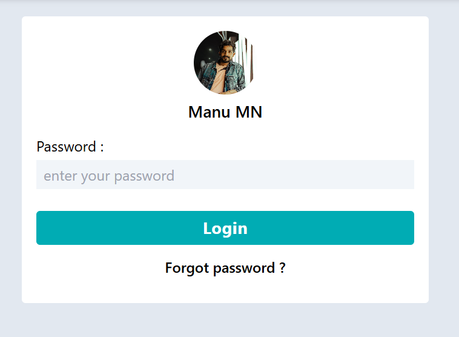
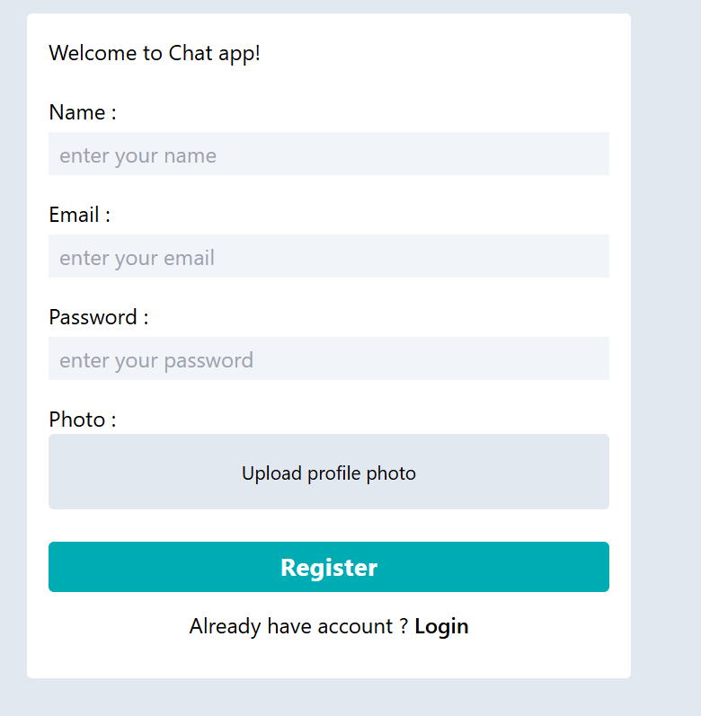
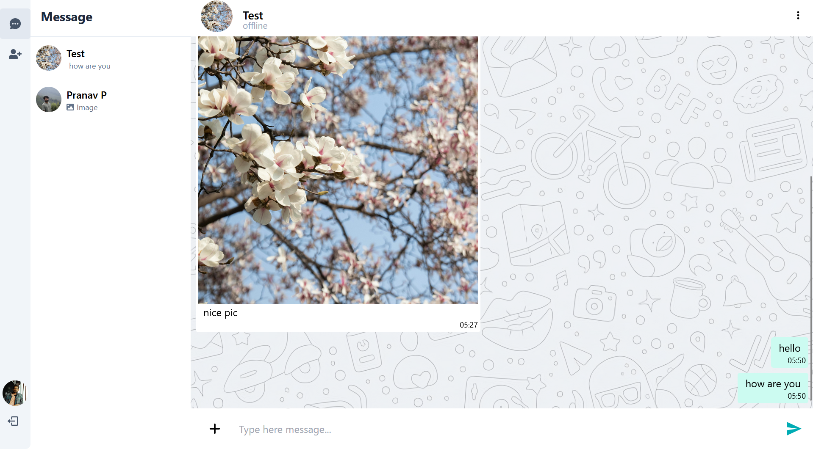
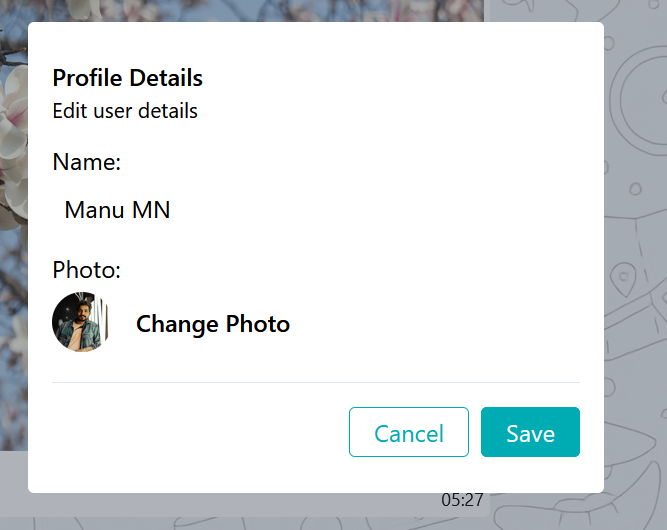

# Chat App

A modern chat application built with React, Redux, and Axios, featuring user profile management and real-time updates.

## Live
https://chatapp-frontend-ten-jade.vercel.app/

### Screenshots

## Login page


## Register Page


## chat page


## Edit page


## Features

- **User Profile Management**: Edit and update user details, including profile picture.
- **Image Upload**: Upload and change profile pictures with a seamless experience.
- **Responsive Design**: Optimized for various screen sizes and devices.
- **Error Handling**: Proper error handling and notifications for user interactions.

## Technologies Used

- **Frontend**: React, Redux, Axios, Tailwind CSS
- **Backend**: Node.js (Express), MongoDB,socket.io
- **Deployment**: Vercel (or any preferred hosting service)


### Prerequisites

- Node.js
- npm or yarn

### Clone the Repository

```bash
git clone https://github.com/manumn95/chatapp-frontend.git
cd client
